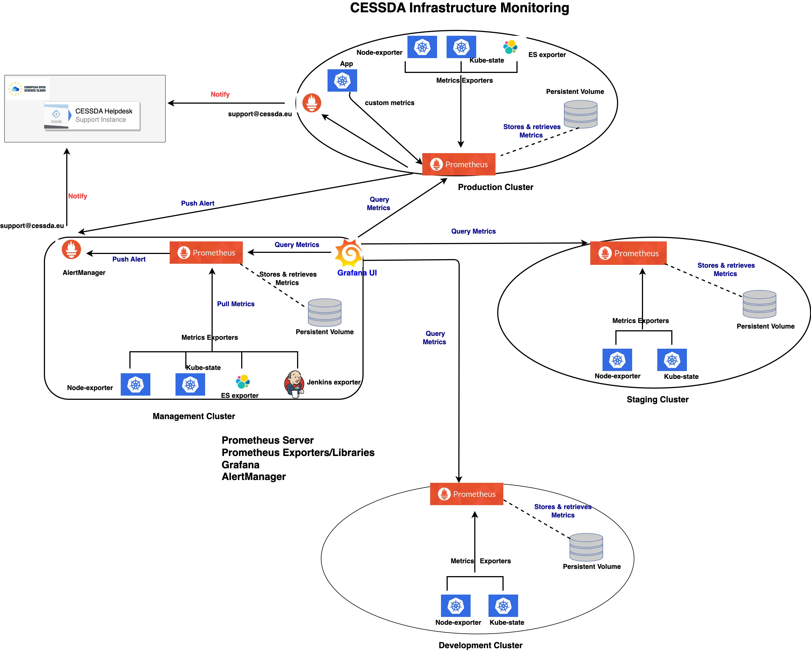

# {{ page.title }}

## Terminology

See [Naming Conventions]().

## Overview

CESSDA Infrastructure monitoring system is built using prometheus stack. 
[Prometheus](https://prometheus.io/) is an open source monitoring and time series system that collects metrics from agents running on target 
hosts, storing the collected data onto the Prometheus server to be analysed for any system indications. Prometheus is one of projects of the Cloud Native Computing Foundation (CNCF).

CESSDA's infrastructure is run and orchestrated by kubernetes which makes Prometheus the natuaral choice for 
Kubernetes monitoring because its data model mirrors Kubernetes infrastructure metadata and also Kubernetes Service Discovery configurations allow retrieving scrape targets from Kubernetes’ REST API and always synchronized with the cluster state. The monitoring system  monitor containerized workloads, integrates with Kubernetes and other components in the cloud ecosystem, 
ingests data, and helps you collect and process metrics such as counters, gauges, histograms, and summaries. 

###  Metrics Gathering
One of the importance aspect of monitoring infrastructure is how metrics derrived for the components in the infrastructure.
We rely on two methodologies; the [USE](http://www.brendangregg.com/usemethod.html) and the [RED](https://www.weave.works/blog/the-red-method-key-metrics-for-microservices-architecture/) methods in understanding which metrics to use and for what.

1. The Utilization Saturation and Errors (USE) Method is a methodology for analyzing the performance of our infrastructure system
- **U**tilization: the average time that the resource was busy servicing work.
- **S**aturation: the degree to which the resource has extra work which it can't service, often queued.
- **E**rrors: the count of error events.

2. The Rate Error and Duration (RED) Method is another methodology use to derrive user expereince metrics for our microservices.
- **R**ate - the number of requests, per second, you services are serving.
- **E**rrors - the number of failed requests per second.
- **D**uration - distributions of the amount of time each request takes.

### Metrics Exposure 
Infrastructure components and services are instrumented within the prometheus stack depending on 
whether they are customised applications or off-the-shelf tools. 

Customised application use  [prometheus client libraries](https://prometheus.io/docs/instrumenting/clientlibs/) depending depending on the application language. CESSDA core products rely on these library to define and expose internal metrics via an HTTP endpoint to prometheus server.
Officially, prometheus supports languages like Java, GO, python and Ruby. There are also unofficial support for other programming languages. 
 
Promethus has  [plugins or exporters](https://prometheus.io/docs/instrumenting/exporters/) for most off-the-shelf application or third party systems used to expose metrics 
especially when it is not feasible to instrument with prometheus metrics directly. 
Most of the CESSDA Infrastructure manangement tools such as HAproxy, Jenkins, Elasticsearch rely on exporters to expose metrics to promethus system.

## Architecture 

Monitoring Architecture is a prometheus stack made of prometheus server, metrics exporters/client libraries, AlertManager and Grafana. 

Prometheus server consist of a time series database (tsdb), a data retrieval agent, and a web server. The data retrieval agent is used to discover targets in Kubernetes and pull metrics from exporters or applications exposed with clients libraries and stores in tsdb. PromQL is a query functional query language that is used to select and aggregate time-series data from Prometheus database.

AlertManager sends notifications through a desired notification channel based on alert rules defined on prometheus operation configurations. 

Grafana receives metrics from prometheuses and create visulaised dashboards for metrics trends and analysis.

### CESSDA Monitoring Composition  

 * Prometheus server are installed across four clusters of CESSDA infrastructure( management, production, staging and development clusters) 
* Kube-state-metrics and Node exporters are the main exporters deployed in the four clusters that collect kubernetes resources metrics to be made available for prometheus server to scrapes and stores metrics in its time series database. 
There are other exporters deployed for third party tools like Jenkins, Elasticsearch and Haproxy depending on whether the tool is running in the cluster. 
* Alertmanger and Grafana are only deployed on the Management cluster to centrally send alert notification and visualize & analyze metrics respectively. 
* Metrics data stored in time-series-database are retained on persistence volume claims in the clusters. Retention policy set on the prometheus are based on size of the data.

