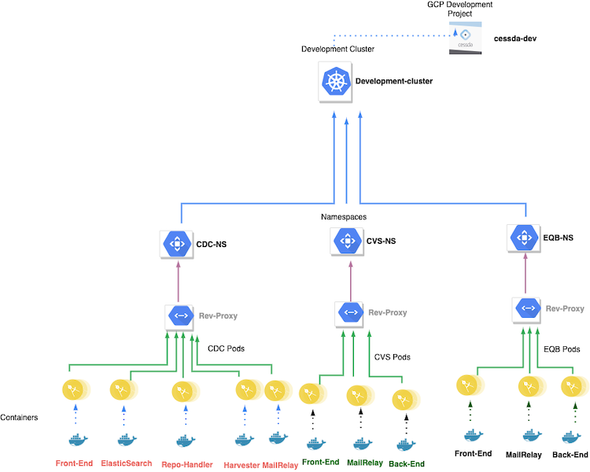
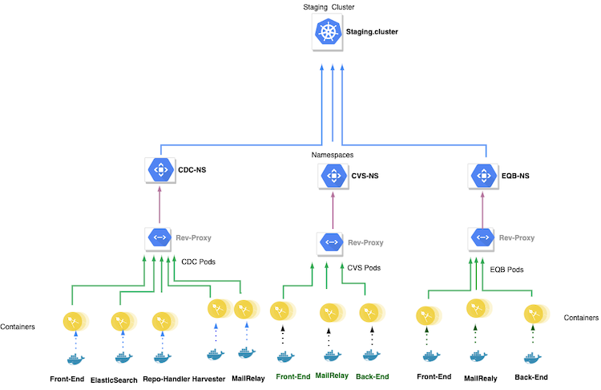
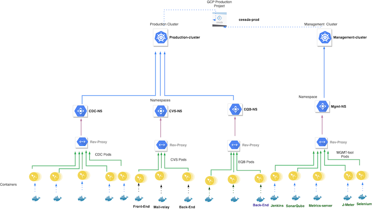

# {{ page.title }}

## Terminology

See [Naming Conventions]().

## Overview

The diagram shows the top-down decomposition of the GCP Projects CESSDA Development and CESSDA Production.

### CESSDA Development GCP Project

The Development project contains two Kubernetes clusters, `development-cluster` and `staging-cluster`.

The `development-cluster` contains the components of the  CDC, CVS, DVS and EQB tools plus some
monitoring and management services. They are separated within the cluster by various namespaces
(`cdc`, `cvs`, `dvs`, `eqb`, `mgmt`, `monitoring`).

The `staging-cluster` contains the components of the  CDC, CVS, DVS and EQB tools plus some
monitoring and management services. They are separated within the cluster by various namespaces
(`cdc`, `cvs`, `dvs`, `eqb`, `mgmt`, `monitoring`).

### CESSDA Production GCP Project

The Production project contains two Kubernetes clusters, `production-cluster` and `management-cluster`.

The `production-cluster` contains the components of the CDC, CVS, DVS and EQB tools plus some
monitoring services. They are separated within the cluster by various namespaces (`cdc`, `cvs`,
`dvs`, `eqb`, `mgmt`, `monitoring`).

