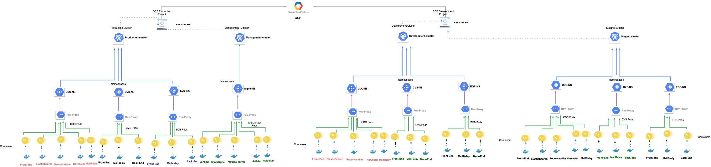

# {{ page.title }}

## Terminology

See [Naming Conventions]().

## Overview

The diagram shows a general overview of the GCP projects, Jenkins CI/CD toolchain and Bitbucket
 code repositories and how they are integrated within the deployment pipeline.

* This designs explains the version control systems in [Bitbucket](https://bitbucket.org/cessda/)

This system allows developers to keep track of the changes in CESSDA software development
 projects, and enable them to collaborate on those projects or tools. There are two types
  repositories to be used in the CI/CD process; Component and Deployment repositories.
  **Component repositories** are software modules or Microservice projects that are version
   controlled. Component repository also contain the Dockerfile which builds the Docker image for
    the module or project. **Deployment repository** contains the scripts that run the deployment
     and also contains some secrets used in the setting up Microservices on clouds. This design
      separates the repositories containing the application software (which may be made Open
       Source at some point) from those containing the deployment scripts and other sensitive
        elements (which will remain private with write access restricted to the CESSDA MO
         Technical team only).

* The design also explains CESSDA's CI/CD automation in [Jenkins](https://jenkins.cessda.eu/).

Jenkins offers a Continuous Integration or Continuous Delivery environment for source code
 repositories using pipelines, as well as automating other routine development and deployment
  tasks. In this design upstream job would be create to parameterizes the Component repository and
   Deployment repository to form a pipeline that compile, builds, builds images, deploys to
    development and staging environments as seen in
     [Deployment_Pipeline]().
      Jenkins deploys automatically into the development and staging
      environments. Jenkins also gives a seamless and more robust way to integrate the entire
       toolchain for build, test, and deployment.

* Google Kubernetes Engine [GKE](https://console.cloud.google.com/kubernetes/)

In this design, there are four clusters in total; three for various environments (development,
 staging and production) in the CI/CD process and the other one (management) which hosts and runs
  the tools used in the build, testing and deployment process.

