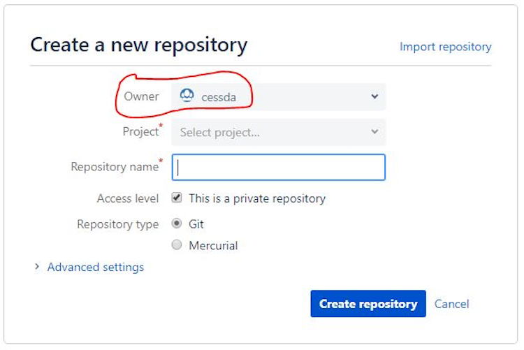

# {{ page.title }}

## Terminology

See [Naming Conventions]().

## Instructions for members of the Platform Team

Before doing anything, you must **log in to Bitbucket using an account that has administrative privileges**.

### First decide which Bitbucket Project to put the repository in

Whichever method you choose from the ones listed below, you need to decide which Project to select when creating the repository.
Projects are used to group repositories in to sets.

The owner is always **cessda** (as per the screenshot below), but the Project is one of

|   **Project**                                           | **Key** | **Description**                                                                                |
|---------------------------------------------------------|---------|------------------------------------------------------------------------------------------------|
|                    CESSDA Architectural Guidelines      | CAG     | Guidelines for potential suppliers of software components for CESSDA's Research Infrastructure |
|                    CESSDA Data Catalogue                |   CDC   |   Components of the CESSDA Data Catalogue, see <https://datacatalogue.cessda.eu/>                |
|                    CESSDA Deprecated Repos              |   CDR   |   Holding area for deprecated repos, prior to deletion                                         |
|                    CESSDA European Question Bank        |   EQB   |   Components of the CESSDA EQB                                                                 |
|                    CESSDA IT Training                   |   CIT   |   Repos used as exemplars for how to build, test and/or deploy our tools and services          |
|                    CESSDA Knowledge Sharing Platform    |   KSP   |   Components of the Knowledge Sharing Platform                                                 |
|                    CESSDA Managed Content               |   CMC   |   Location for managed content, such as CVs, Thesauri                                          |
|                    CESSDA Metadata Validator            |   CMV   |   Used to validate ingested DDI content                                                        |
|                    CESSDA Operations                    |   COPS  |   Operational issues (administration of toolchain, utility scripts etc)                        |
|                    CESSDA Research Infrastructure       |   CRI   |   Infrastructure management                                                                    |
|                    CESSDA Service Portfolio Management  |   CSM   |   Tools for managing Service Portfolio management                                              |
|                    CESSDA Thesaurus                     |   CET   |   Thesaurus for ELSST, running on Skosmos using Apache Jena Fuseki as the backend.             |
|                    CESSDA Vocabulary Service            |   CVS   |   Components of the CESSDA Vocabulary Service, see <https://vocabularies.cessda.eu/>             |
|                    SSHOC Dataverse                      |   DVS   |   Components of the SSHOC Dataverse product                                                    |

### Create an empty repository

If it is a *greenfield development* simply create a new repository, add a description and assign it to one of the above projects.

See [Create a repository](<https://support.atlassian.com/bitbucket-cloud/docs/create-a-repository/>)
for more details.

Then add the [standard contents](),
some of which will remain unchanged, others of which need to be edited by the code contributors.

### Create a repository for existing files/projects

If there is a project in an external location, but with just a few unversioned files in it,
create a repository on Bitbucket and add the code to it.

See [Add unversioned code to a repository]
(<https://support.atlassian.com/bitbucket-cloud/docs/add-unversioned-code-to-a-repository/>) for more details.

### Import or convert code from an existing tool

To get code from an existing project into Bitbucket Cloud quickly from another hosting site or system,
Bitbucket provides an importer to grab a repository. See
[Import or convert code from
    an existing tool](<https://support.atlassian.com/bitbucket-cloud/docs/import-or-convert-code-from-an-existing-tool/>).
for more details.
