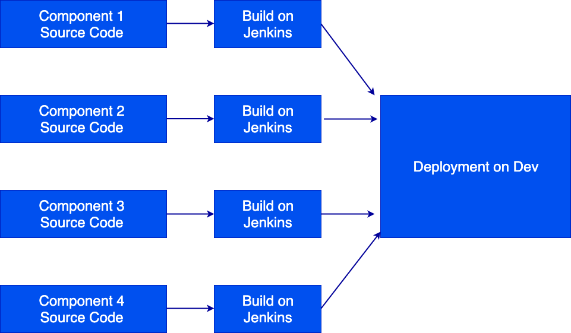
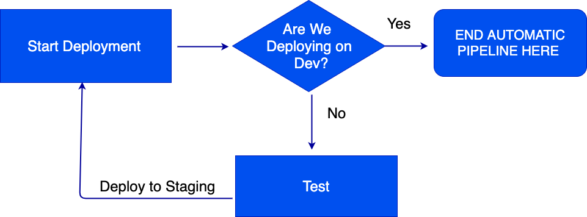
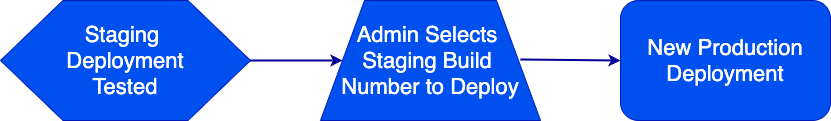
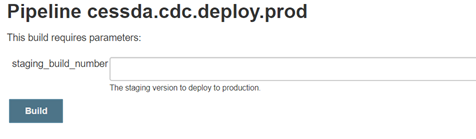

# {{ page.title }}

## Terminology

See [Naming Conventions]().

## Overview

Each component is built by Jenkins. The build is controlled by a
[Jenkinsfile](https://jenkins.io/doc/book/pipeline/getting-started/#defining-a-pipeline-in-scm) located at the root of the
components source code repository. The component's source code is scanned using [SonarQube](https://www.sonarqube.org/) to
check code quality and identify any significant issues (such as lack of test coverage or known security vulnerabilities).
If the pre-defined [quality gates](https://docs.sonarqube.org/latest/user-guide/quality-gates/) are not passed then there
is the option to stop the pipeline and abandon the current build or deployment process.



**Figure 1:** *The pipeline for building applications from source code*

Each component is packaged as a [Docker container](https://www.docker.com/resources/what-container) at the end of the build
process and given a unique image tag based on the Jenkins build number.

## Deploying the Components

The pipeline is used to deploy the same build of a component (the Docker container) to the development, staging and production
environments, but different tests take place between each deployment step.



**Figure 2:** *The pipeline for automatically deploying applications to staging*

### Deploying to Development and Staging

The deployment of all the components for a CESSDA application are controlled by a single Jenkinsfile in a repository called
cessda.${app_name}.deploy, where ${app_name} is the name of the application as a three-letter code.
This repository stores the configuration of the components in the form of Kubernetes manifests.
These define the settings used by each component and, if necessary, secrets that hold credentials and other sensitive information.

A new deployment occurs every time code changes are pushed to any of the component source code reporitories.
This deployment occurs on the `development-cluster` and is exposed at the development endpoint of the application.

A conditional stage in the Jenkinsfile will automatically start Selenium tests only when a new deployment occurs on the
`development-cluster`.
This prevents infinite loops occurring when the tests finish and a new staging build is created.
When the tests pass, the Docker images are tagged as staging and are deployed to the `staging-cluster`.
Retagging occurs to show that these images have been certified to function together and should be deployed together.

```groovy
stage('Run Selenium Tests')
{
    steps
    {
        build job: 'cessda.${app_name}.test', wait: false
    }
    when
    {
        environment name: 'cluster', value: 'development-cluster'
    }
}
```

**Figure 3:** *The code that prevents the infinite loops. From cessda.${app_name}.deploy/Jenkinsfile.*

### Deploying to Production



**Figure 4:** *The pipeline for deploying applications to production*

Deploying to the `production-cluster` is initiated by a manual step and is done with the Jenkins job
`cessda.${app_name}.deploy.prod`.
To deploy a new version of the application, select ‘Build with parameters’ and enter the staging build number that you want to deploy.




**Figure 5:** *An example of the production build job from CDC*

The staging build number entered here MUST be a number found in `https://jenkins.cessda.eu/job/cessda.${app_name}.test`
that has passed.
This is where the staging build numbers are assigned.
This also ensures that a development build cannot directly be deployed to production.
