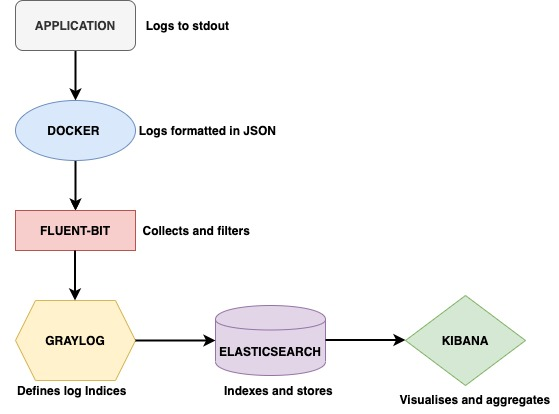

# {{ page.title }}

## Terminology

See [Naming Conventions]().

## Introduction

CESSDA follows the recommendation from the [Twelve-Factor App](https://12factor.net/)
on logging which recommends that applications running processes should write their events stream to `stdout`.
In every deployment environments, each process stream should be captured by the execution environments.
Each application has a different log streams for the various deployment environments.

## Logging processes

CESSDA uses a variation of the Elastic Stack for logging, namely Elasticsearch, Fluent Bit and Kibana (EFK).
In the EFK stack, Fluent Bit is used as the log router, instead of `logstash`.
The log pipeline for CESSDA is as below:

- The application must log each line of the stream into `stdout` *or* `stderr`

- The Docker engine uses JSON-file log driver to interpret each line as one log event and output as JSON

- Fluent Bit collects logs and uses Kubernetes Filters to allow enrichment of log files with Kubernetes metadata.

- Graylog server defines and indexes logs into Elasticsearch.

- Elasticsearch stores log indices for querying.

- Logs are queried, aggregated and visualized with Kibana

## Log levels

CESSDA uses four types of logging levels:

- DEBUG: Fine-grained information about what is going on within the system.
  This log level is disabled on production systems

- INFO: Announcements about the normal operation of the system - scheduled jobs running,
  services starting and stopping, significant user-triggered processes.
  This log level is disabled on production systems

- WARN: Any condition that, while not an error in itself, may indicate that the system is running sub-optimally

- ERROR: A condition that indicates something has gone wrong with the system
