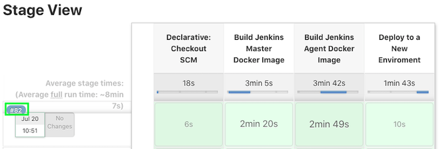
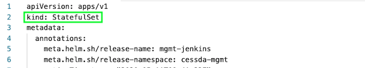
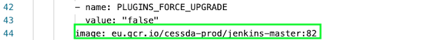

# {{ page.title }}

## Terminology

See [Naming Conventions]().

## Overview

Many 3rd party tools used in the CESSDA  environment are updated occasionally,
either to fix bugs or to add features.

## Updating Docker Images

Tools that run as Docker containers in Kubernetes clusters are deployed by Jenkins from CESSDA repositories.
Updating these should be as simple as updating the image tag and then pushing the changes.
Some applications may have more involved steps if breaking changes are made. Keep an eye on release notes to see if any changes are needed.

In any case, the changes should be made in the Sandbox first, and only applied to the production toolchain when it is clear that they are non-breaking.

## Updating Jenkins

To update Jenkins, run the *cessda.mgmt.jenkins* job in the Jenkins master.
Make sure to use the default settings for the build.
This will create a new Docker image and push it to the CESSDA repository.
Make a note of the image tag created. It should match the build number in Jenkins.

In the Google Cloud console, open the *cessda-prod* project, go to Kubernetes Engine -> Workloads
and select the *mgmt-jenkins* Stateful Set. Click to open the details page.

Now select the YAML tab to see the Jenkins Stateful Set definition.

Change the Stateful Set’s image tag to be the one built by Jenkins, then click save.
Jenkins should then update. This process can take several minutes to complete.

If Jenkins doesn’t restart after updating, revert the image tag back to the previous version.
