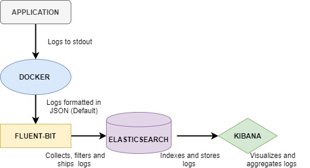

# {{ page.title }}

## Introduction

CESSDA follows the recommendation from the [Twelve-Factor App](https://12factor.net/)
on logging which recommends that applications running processes should write their events stream to `stdout`.
In every deployment environments, each process stream should be captured by the execution environments.
At CESSDA, for each application we have different log streams for the various environments.

This guideline aims to have application logging consistent within the application, consistent across an organization's
service portfolio and use industry standards and best practice where relevant,
so the logged event data can be consumed, correlated, analysed and managed by its central logging system.

## Logging processes

At CESSDA, we use a variation of the Elastic Stack for our logging.
In our EFK stack, we rely on Fluent Bit as our log router, instead of `logstash`.
The log pipeline for CESSDA is as below:



* The application must log each line of the stream into `stdout` *or* `stderr`
* Docker engine uses JSON-file log driver to interpret each line as one log event and output
 as JSON
* Fluent Bit collects logs and filters with Kubernetes Filters to  allow enrichment of log
 files with Kubernetes metadata and finally routes the logs to Elasticsearch input.
* Elasticsearch indexes and stores log events received from output of Fluent Bit
* Logs are searched, aggregated and visualized with Kibana

## Purpose of logging

Logging of CESSDA applications is important and brings benefits to the following group of people:

* CESSDA Platform support: Provide detail evidence of problems to help to resolve issues

* Developers: Allow to trace code execution without the use of debugger

## Loggers

Depending on the programming language, you may choose any logging client or logging framework that suits you.
It must properly be defined in each of the classes that performs logging.

For example, the harvester component (Java) in Data Catalogue Application uses Logback with
`lombok` extension.
Example from the above harvester component is below:

```java
@Slf4j
public class ConsumerScheduler {
 public void weeklyFullHarvestAndIngestionAllConfiguredSPsReposRecords(){
  log.info("Once a Week Full Run. Triggered by cron - STARTED");
  }
}
```

## Log levels

CESSDA uses four types of logging levels:

* DEBUG: Fine-grained information about what is going on within the system. This log level
 is disabled on production systems.
* INFO: Announcements about the normal operation of the system - scheduled jobs running,
 services starting and stopping, significant user-triggered processes.
 This log level is disabled on production systems.
* WARN: Any condition that, while not an error in itself, may indicate that the system is
 running sub-optimally
* ERROR: A condition that indicates something has gone wrong with the system

The Default log level for CESSDA is WARN.
This communicates to the Platform support team that this message needs some kind of attention.
In such a scenario, an issue should be created in the Bitbucket issue tracker for resolution.
Below is the example from the CDC harvester:

`log.warn("Could not parse RecordIdentifier lastModifiedDate")`

## Parameterize logging  and fields creation

Most frameworks provide parameterised logging capabilities.
Parameterised logging allows you to specify parameters in your log statement which will be evaluated only if the log is actually processed.
CESSDA recommends that Developers choose a logging framework that implements parameterisation.
In  SLF4J Logger, it is indicated in the logging statement with a string {}.
This allows a more readable syntax than concatenating strings.
It also yields better performance as the string will only be concatenated when required.

It should be also possible to choose a framework that allows extra fields (key-value pairs)
to be created to allow for flexibility and easy ingestion into the logging system.
Below is an example of such.

```java
log.info("BulkIndexing repo [{}] with lang code [{}].", value("repo_name", repo.getName()), value("lang_code", lang));
```

## Context

Curating a log message to indicate what is happening to a block of code is very important.
Indicate what the operation is attempting to do, what object you are trying to act on and why that is required.
For instance, when logging exceptions, indicate the operation failure,
the objects that it acts on and detail the exception so the stack-trace can be logged.

Below is an example of good exception logging

```java
log.error("[{}] Failed to get StudyId [{}]: {}: {}",
 repo.getName(),
 value(LoggingConstants.STUDY_ID, studyNumber),
 value(LoggingConstants.OAI_ERROR_CODE, exception.getCode()),
 value(LoggingConstants.OAI_ERROR_MESSAGE, exception.getErrorMessage()),
 exception
);
```

The message text explains the failure and includes all relevant information.
The name of the repository, the Study ID, the code and optional message are logged.
Finally, the exception is attached allowing for the full stack trace to be printed.
