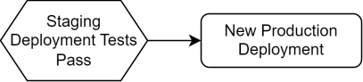

# {{ page.title }}

## Terminology

See [Naming Conventions]().

## Deploying the Components

The pipeline is used to deploy the same build of a
 (the Docker container) to the
staging and production environments.


**Figure 2:** *The pipeline for automatically deploying applications*

### Deploying to Staging

The deployment of all the components for a CESSDA application are controlled by a single Jenkinsfile in a repository called
`cessda.${app_name}.deploy`, where `${app_name}` is the name of the application as a short code.
This repository stores the deployment configuration of the components in the form of Kubernetes manifests.
These define the settings used by each  and,
if necessary, secrets that hold credentials and other sensitive information.

A new deployment occurs every time code changes are pushed to any of the
 source code repositories.
This deployment occurs on the `staging-cluster` and is exposed at the development endpoint of the application.

A conditional stage in the Jenkinsfile will automatically start Selenium tests only when a new deployment occurs on the
`staging-cluster`.
This prevents infinite loops occurring when the tests finish and the production deployment completes.
When the tests pass, the Docker images are deployed directly to the `production-cluster`.

```groovy
stage('Run Selenium Tests') {
    steps {
        build job: 'cessda.${app_name}.test', wait: false
    }
    when {
        environment name: 'cluster', value: 'staging-cluster'
    }
}
```

**Figure 3:** *The code that prevents the infinite loops. From `cessda.${app_name}.deploy/Jenkinsfile`.*

### Deploying to Production



**Figure 4:** *The pipeline for deploying applications to production*

Deploying to the `production-cluster` is initiated automatically once the tests in `cessda.${app_name}.test` pass. This is accomplished by having the `cessda.${app_name}.test` call the `cessda.${app_name}.deploy` job with the staging image tags and the cluster set to the `production-cluster`.
