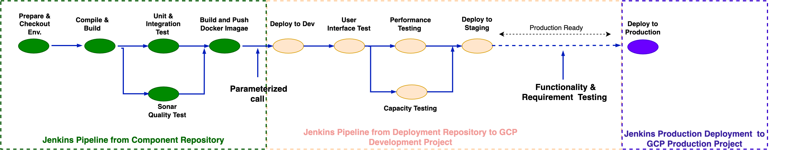

# {{ page.title }}

## Terminology

See [Naming Conventions]().

## Overview

The diagram shows the deployment pipeline in CESSDA's Continuous Integration and Delivery process,
from the moment a developer commits code changes to the deployment of the   to production.

More elaborative procedure is found in [Deployment-Workflow]()

