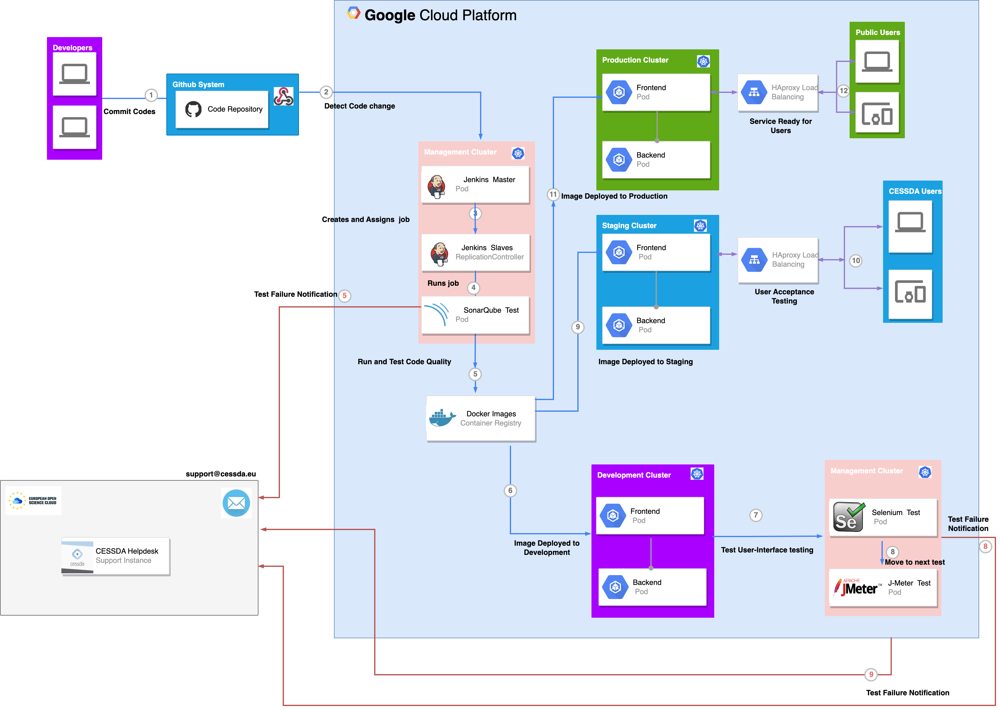

# {{ page.title }}

## Terminology

See [Naming Conventions]().

## Overview

CESSDA uses continuous integration to automatically build, test and deploy new versions of software to the CESSDA infrastructure.

The process is automated from the time the developer commits source code changes to the time an
instance of the module or  is deployed to the development and staging environments. However, deployment to the production environment is manually initiated after testing and sign-off in the staging environment.

[Helm charts]() are used to orchestrate the deployment of an application's components.

The diagram shows the step-by-step process by which application components are deployed on CESSDA's Technical Infrastructure and the various technologies that are involved.

