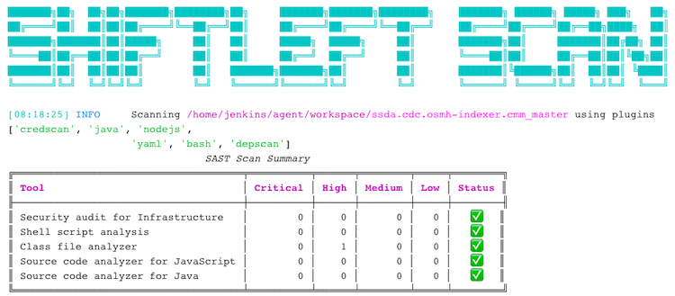
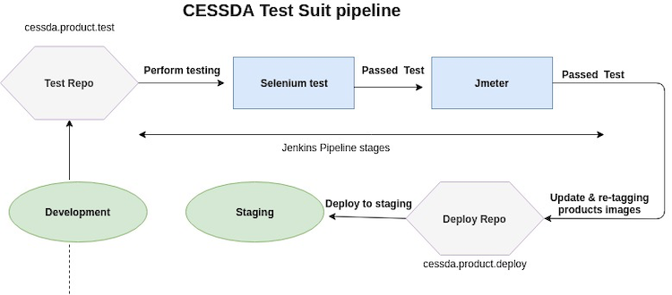

# {{ page.title }}

## Terminology

See [Naming Conventions]().

## Overview

The standard CESSDA   test suite is made up of:

- [Selenium testing](https://github.com/cessda/cessda.mgmt.selenium/src/master/)

- [Jmeter testing](https://github.com/cessda/cessda.mgmt.jmeter/src/master/). See the README file for more details.

- [SonarQube quality gate](https://github.com/cessda/cessda.mgmt.sonar/src/master/)

The tests are performed as part of the build process. If the tests pass, the Docker image is created and pushed to the Docker image registry.

- [ShiftLeft SAST scan](https://www.shiftleft.io/scan/)

The Static Analysis (SAST) scan runs against the newly built Docker image.
The results are shown in the Jenkins job console output (see example below):

## Software testing Pipeline

### Testing Suite Jenkinsfile template (cessda.product.test)

See [Template Jenkinsfile]() or
[Template Jenkinsfile for JDK11 Maven projects]()
