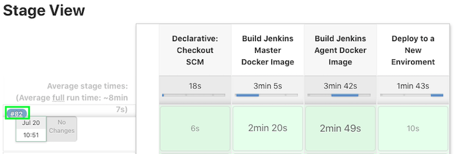
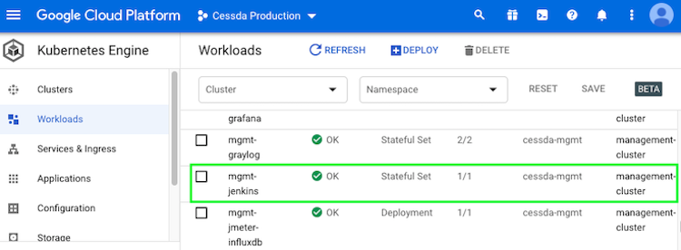
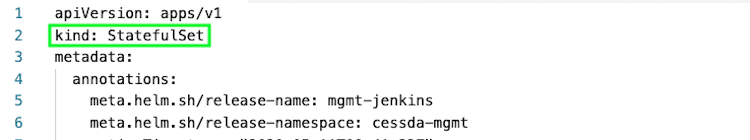
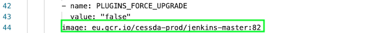

# {{ page.title }}

## Terminology

See [Naming Conventions]().

## Overview

Many 3rd party tools used in the CESSDA  environment are updated occasionally,
either to fix bugs or to add features.

## Updating Docker Images

Tools that run as Docker containers in Kubernetes clusters are deployed by Jenkins from CESSDA repositories.
Updating these should be as simple as updating the image tag and then pushing the changes.
Some applications may have more involved steps if breaking changes are made. Keep an eye on release notes to see if any changes are needed.

## Updating Jenkins

To update Jenkins, run the `cessda.mgmt.jenkins` job in Jenkins.
Make sure to use the default settings for the build.
This will create a new Docker image and push it to the CESSDA repository.
The job will automatically try to update the deployment to use the new image version.

### If Jenkins Fails to Start

In the Google Cloud console, open the `cessda-prod` project, go to Kubernetes Engine -> Workloads
and select the `mgmt-jenkins` Stateful Set. Click to open the details page.

Verify that the Jenkins container is failing to start before proceeding. This is so that issues like networking configuration can be excluded as causes.

If Jenkins is failing, to revert to the previous version of Jenkins select the YAML tab to see the Jenkins Stateful Set definition.

Change the Stateful Set’s image tag to be the image that was used before the upgrade, then click save.
Jenkins should then update. This process can take several minutes to complete.

