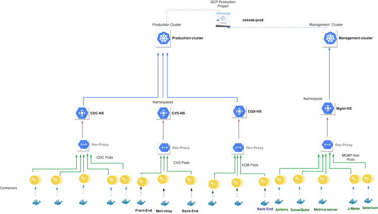

# {{ page.title }}

## Terminology

See [Naming Conventions]().

## Overview

The diagram shows the top-down decomposition of the GCP Projects CESSDA Development and CESSDA Production.

The application clusters (`development-cluster`, `staging-cluster` and `production-cluster`) contains the components of applications such as CDC, CVS and ELSST, separated into individual namespaces (e.g. `cdc`, `cvs`, `elsst`). Each cluster is structurally a mirror of the others allowing the same configuration to be used across all application clusters.

### CESSDA Development GCP Project

The development project contains two Kubernetes clusters, `development-cluster` and `staging-cluster`.

The development cluster is where newly built components are deployed. Components are deployed directly after a successful build. Integration tests are run against components deployed to this cluster. Applications may break at any time in this cluster.

The staging cluster is deployed to after integration and is used as a basis for user testing. Components are deployed to this cluster after integration tests have passed. Stability of applications in the staging cluster is maintained on a best effort basis.

### CESSDA Production GCP Project

The Production project contains two Kubernetes clusters, `production-cluster` and `management-cluster`.

The `production-cluster` contains released versions of applications. These have stability guarantees and have redundancy configured.

