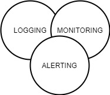

# {{ page.title }}

CESSDA IT observability is a business process that collects and analyses data from its infrastructure
and leverages that data to improve business results and drive value creation for the organisation.
Observability of the infrastructure includes:

- CESSDA  (such as CDC, CVS, EQB, ELSST)

- Infrastructure   (eg. Jenkins jobs)

The observability strategy is made up of three pillars:

1. **Metrics Monitoring:** Metrics represent the raw measurements of resource usage or behaviour that can be
  observed and collected throughout the infrastructure.
  The [monitoring system]() collects, exposes,
  and analyses those values to improve the services and optimise the infrastructure as a whole.
1. **Logging & aggregation:** Logs are detailed records of events that occur within the components
  or the Infrastructure in general.
  CESSDA has a [central logging system]() that collects, aggregates,
  filters and enriches the contents of the logs and enables visualisation of system and product events,
  which then aid the debugging process and problem solving capabilities.
1. **Alerting:** Alerting is the responsive component of the observability system that performs actions based on
  changes in metrics, threshold violations or/and the occurrence of unacceptable conditions.

Alert notifications, sent via email (to CESSDA helpdesk system)  or dedicated
Slack channels. The system alerts on the following elements:

- Metrics: that are generated from the monitoring system.
- Logs: produced from the logging system if failures or unacceptable conditions occur.
- Service Endpoints: [availability]().
- Processes: generated when there are failures in the  processes.
