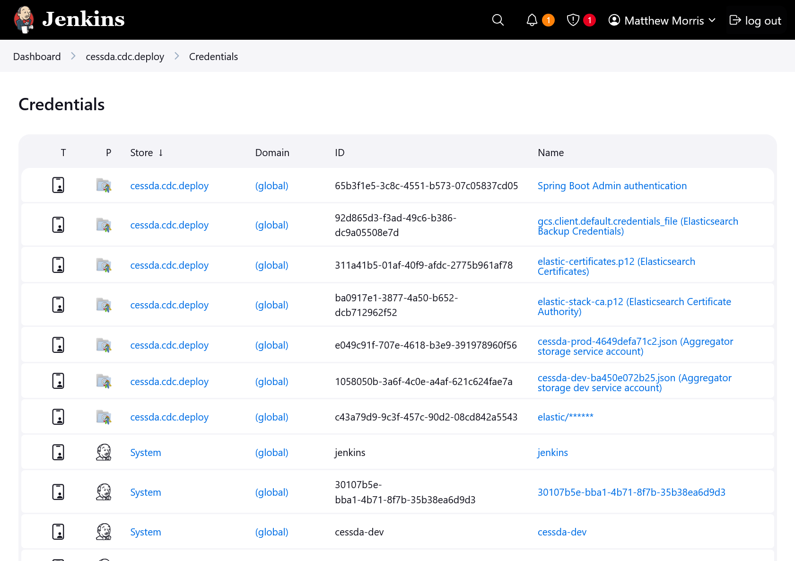

# {{ page.title }}

## Terminology

See [Naming Conventions]().

## Introduction

Secrets are information that should not be public. These include certificates, credentials, etc.
Secrets must not be stored in source code repositories, because SCMs such as Git
store a complete copy of the the repositories history.
As such, any secrets committed to a Git repository should be considered undeletable.

Secrets should be managed by external utilities, and be inserted into deployments as part of the CI/CD pipeline.

## Storing Secrets

Secrets within CESSDA are managed with Jenkins.
The secrets for each product are scoped to the secret store associated with each deployment repository.



## Using Secrets in a Jenkins Pipeline

Secrets are available as environment variables, files or SSH credentials.

Environment variables should be substituted in a shell script, not using Groovy string substitution.

```groovy
stage('Deploy CDC') {
    environment {
        ADMIN_CREDS = credentials('65b3f1e5-3c8c-4551-b573-07c05837cd05')
        ELASTIC_CREDS = credentials('37714f5c-1e79-4d49-959d-50a46987f594')
    }
    steps {
        script {
            // Storage bucket settings
            def storageBucket
            def gcsfuseServiceAccount
...
```

The `credentials()` function takes a credentials identifier and sets the following environment variables.

* ADMIN_CREDS=`${username}:${password}`
* ADMIN_CREDS_USR=`${username}`
* ADMIN_CREDS_PSW=`${password}`

See <https://www.jenkins.io/doc/book/pipeline/syntax/#environment> for more details how to use the `credentials()`.

```groovy
steps {
  // Note the use of single quotes (') rather than double quotes ("),
  // this prevents Groovy string interpolation from substituting
  // environment variables before the script is executed
  sh 'using credentials ${ADMIN_CREDS}'
}
```
