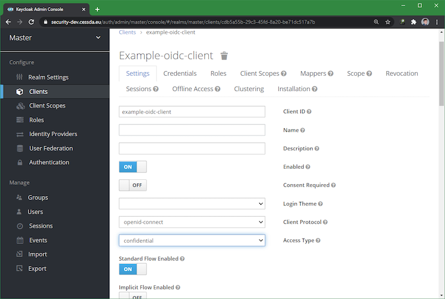

# {{ page.title }}

All CESSDA tools and services are exposed to the public internet, but not all of them should be accessible to the public.
Previously we used HAProxy to provide basic authentication, however this encountered issues when used with applications that
authenticate themselves (such as CVS2).

This document details the process of setting up *oauth2-proxy*,
a tool that delegates the authentication to an oauth2 server and stores the session in a cookie.

## Setup

Like all other deployed components, oauth2-proxy is deployed using a Helm chart.

A cookie secret must be generated for each deployment. This is done at the chart level using Helm.

- Use the GCP health checks
  - These provide liveness and readiness probes
- The backend is configured to use the standard service endpoint of the protected service
  - `--upstream=https://mgmt-graylog:9000/`

### Set up Keycloak

Create an OpenID Connect (OIDC) client (see below):

Set the access type to confidential. This is needed to get the client secret (see below):

Retrieve the secret from the credentials tab (see below):

### Configure oauth2-proxy

- In the manifest, add the client id and secret
  - `--client-id=example-oidc-client`
  - `--client-secret=1166ed11-bdb5-414f-9742-ed1898a2c4e7`
- Set the OIDC issuer URL to the realm endpoint
  - `--oidc-issuer-url=https://keycloak.cessda.eu/auth/realms/master`
  - Note that this is an example value
- If the backend uses basic authentication, disable passing basic authentication headers
  - `--pass-basic-auth=false`
  - This prevents potential authorisation conflicts
