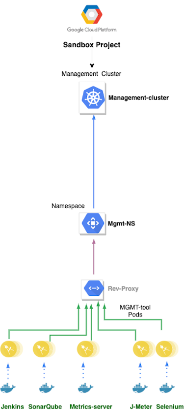

# {{ page.title }}

## Terminology

See [Naming Conventions]().

## Platform

CESSDA uses Google Cloud Platform (GCP) as the basis for its Technical Infrastructure.

GCP has the concept of [Projects](https://cloud.google.com/docs/overview/)
to group a set of computing resources and keep them separate from those belonging to other Projects.
To date, the Technical Infrastructure consists of three GCP projects, CESSDA Production, CESSDA Development and CESSDA Sandbox.

## General Principles for GCP Projects

The structure of each GCP project follows the same set of principles:

- a project contains one or more
 [Kubernetes clusters](https://kubernetes.io/docs/concepts/overview/components/)
- a cluster contains components of the same logical type (development, staging, production,
 management) that form parts of different products.
- every   is a
 [Docker container](https://www.docker.com/resources/what-container)
- each [Kubernetes cluster namespace](https://kubernetes.io/docs/concepts/overview/working-with-objects/namespaces/)
 contains components belonging to a single product, and logically separates them from the
  contents of other namespaces in that cluster
- external access to the components in each namespace is mediated by a reverse proxy situated in
 that namespace
- all the namespaces in a cluster and hence all the components in a cluster share the computing
 resources allocated to that cluster

The Google Kubernetes Engine (GKE) is an environment for deploying containerized (i.e. Dockerized)
applications.
A Docker container provides an isolated context in which an application can run with its own environment.
At every deployment instance, container images are built and pushed to the Google Cloud registry associated
with the GCP Production project.
Docker containers use these images when running the applications.
This enables GKE to provide rapid application development by making it easy to deploy, update,
and manage CESSDA's products.
GKE can operate both in stateless mode, and also can be configured to deploy backing components like persistent volumes/storage,
and even run a database in the cluster.

## CESSDA Development GCP Project

See also [Technical Infrastructure Details]().

The CESSDA Development GCP Project contains two Kubernetes clusters, `development-cluster` and `staging-cluster`.
See [GCP Main Project Structure]() for more details of the clusters.

## CESSDA Production GCP Project

The CESSDA Production GCP Project contains two Kubernetes clusters, `production-cluster` and `management-cluster`.
 See [GCP Main Project Structure]() for more details of the `production-cluster`.

The management-cluster contains various utility, monitoring, testing and deployment tools,
based on 3rd party components including:

- [AlertManager](https://prometheus.io/docs/alerting/alertmanager/) for automatic alerting when
 faults or alarm conditions occur
- [Certbot](https://certbot.eff.org/) for automated TLS/SSL certificate renewal
- [Grafana](https://grafana.com/) for visualisation of monitoring data
- [Graylog](https://www.graylog.org/) for log aggregation
- [HAProxy](https://www.haproxy.org/) for reverse proxying
- [Jenkins](https://jenkins.io/) for CI/CT - build, test and deploy components
- [JMeter](https://jmeter.apache.org/) for stress testing
- [Kibana](https://www.elastic.co/kibana) for analysing and visualising the contents of ElasticSearch indices
- [Nexus](https://www.sonatype.com/product-nexus-repository) for local caching of build artefacts
- [Prometheus](https://prometheus.io/) for   monitoring
- [Selenium](https://www.seleniumhq.org/) for user journey testing
- [SonarQube](https://www.sonarsource.com/products/sonarqube/) code quality analysis

It also contains a Docker Registry - images built in the `management-cluster` are pushed to it,
and deployments to other clusters in the project pull from it.

## CESSDA Sandbox GCP Project

The GCP Sandbox project contains a management-cluster which contains various utility, monitoring,
testing and deployment tools, based on 3rd party components.
The list is similar to that above, and it is used to test updates to the 3rd party components,
before rolling them out to the production management-cluster.
It may also contain other ephemeral clusters as required (e.g. to be used for deploying components during training events).

It also contains a Docker Registry - images built in the `management-cluster` are pushed to it,
and deployments to other clusters in the project pull from it.

## Multiple Deployment Environments

The `development-cluster` acts as the development environment,
the `staging-cluster` acts as the staging environment
and the `production-cluster` acts as the production environment.

Therefore the development instance of a 
is deployed to the `development-cluster` of the CESSDA Development GCP Project,
the staging instance of a  
is deployed to the `staging-cluster` of the CESSDA Development GCP Project,
and the production instance of a  
is deployed to the `production-cluster` of the CESSDA Production GCP Project.

To put this in the context of a specific tool, the CDC development instance is deployed to the `development-cluster`
of the CESSDA Development GCP Project,
the staging instance of CDC is deployed to the `staging-cluster` of the CESSDA Development GCP Project,
and the CDC production instance is deployed to the `production-cluster` of the CESSDA Production GCP Project.
The same goes for the development, staging and production instances of CVS, DVS and EQB.
Therefore the `development-cluster` acts as the development environment, the `staging-cluster`
acts as the staging environment and the `production-cluster` acts as the production environment.

## Application Deployment Process

See also [Deployment Pipeline overview]()
and [Deployment Pipeline details]().

[Jenkins pipelines](https://jenkins.io/doc/book/pipeline/) are used to build, test and deploy components.
The general principle is to build once, deploy many times, configure on launch and automatically test en route.
Components are deployed to three different environments (the `development-cluster`, `staging-cluster` and `production-cluster` described above).
The Docker registry is used as local storage to enable the 'build once, deploy many times' approach.

### Jenkinsfile examples

See [Example Jenkinsfile with Annotations]().

See [Jenkinsfile template for JDK11 Maven Projects]().

### Example Deployment - CESSDA Data Catalogue

In the case of the CDC, there is a master branch (which can have feature branches, as required).
When commits are made to master, a successful build deploys to the development cluster.
After further testing, it is automatically deployed to the staging cluster.
If ready to go live, it is manually deployed to the `production-cluster`
([datacatalogue.cessda.eu](https://datacatalogue.cessda.eu/)).

### Deployment vs Application Code

The deployment scripts are generic, and are parameterised for each component
and each deployment environment at the point of use.

All the deployment, monitoring and management code has been separated out from the source code for
each tool by the use of different repositories.
So the developers have write access to the   repositories
and the CESSDA Platform team have write access to the deployment code.
This allows for the possibility of making the   Open Source
without revealing the specifics of the configuration of one or more clusters.

### Responsibilities

Developers are responsible for delivering code that complies with the prevailing CESSDA Technical standards.
Source code must comply with the [relevant guidelines]().
The CESSDA Platform team work with Developers to devise and put in place some or all of the tests
used to ensure compliance with the guidelines. Developers are expected to fix any defects revealed by the tests.

Developers should provide [Unit tests](https://en.wikipedia.org/wiki/Unit_testing) for their products,
and the CESSDA Platform team will work with the developers and/or relevant user groups
to develop Selenium tests to cover the main user journeys for each product.

The CESSDA Platform team is responsible for creating and updating the scripts
that deploy products to the various build environments (development, staging, production).

There is an reverse proxy in front of all deployed tools,
which is responsible for automatically checking and updating the [Let's Encrypt](https://letsencrypt.org/)
security certificates associated with the subdomain names for each deployment.
